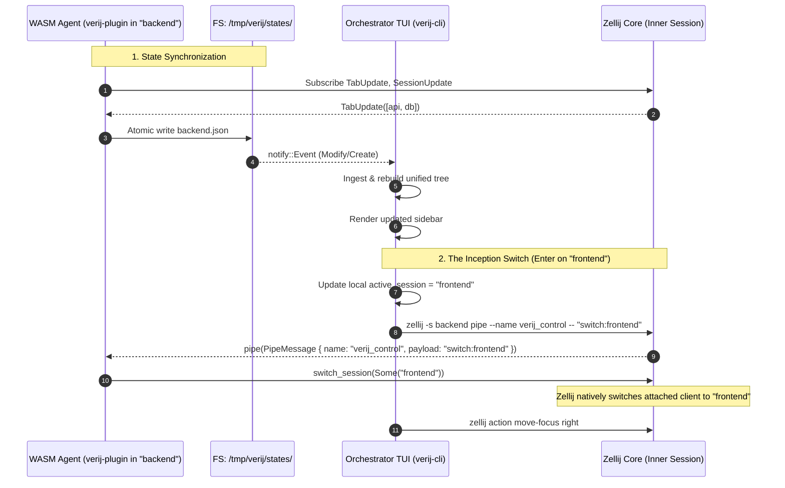

# Verij Architecture

> **Context anchor** — This document is the authoritative reference for the Verij system design. It defines the Distributed Agent ("Inside Man") architecture, filesystem state synchronization, and pipe-injected native session switching ("The Inception Switch").

---

## 1. Executive Summary & Architectural Pivot

### 1.1 The Problem with the Single-Plugin Architecture
The initial Verij implementation relied on a single WASM plugin instance running in the Host Session, attempting to:
1. Poll all global Zellij sessions via `get_session_list()` on a timer loop.
2. Stream global snapshots over a Zellij CLI pipe (`verij_events`) to the TUI.
3. Manage the attached session in the right pane via out-of-band hacks: inspecting `/proc` on Linux to discover sibling process IDs, terminating `zellij attach` with `kill -TERM`, and typing commands into the terminal pane via `zellij action write-chars`.

This approach suffered from several fundamental failure modes:
- **State Staleness & Ghost Tabs**: `get_session_list()` polling does not trigger immediate updates on inner session tab switches, and multi-client attachments cause Zellij to report multiple tabs as active simultaneously.
- **Pipe Deadlocks & Broken Streams**: CLI pipes in Zellij are fragile when handling reconnects or high-frequency updates, causing reader blocking and dropped frames.
- **Terminal Corruption via `/proc` Hacks**: Arbitrarily killing `zellij attach` and injecting text characters directly into the PTY caused race conditions, missed keystrokes, and garbled terminal escape sequences.

### 1.2 The Pivot: Distributed Agent Pattern
Verij pivots to a **Nested Session & Distributed Agent** model:
- **Host Session Isolation**: The outer wrapper session is strictly isolated and identified by the prefix `__verij_host_`. The TUI filters out any host sessions from the navigation tree.
- **Inside Man (Distributed WASM Agent)**: `verij-plugin` runs inside **every inner session**. Each agent is authoritative only for its own session's state.
- **State Synchronization via Filesystem Watcher**: Each agent serializes its own session state directly to `/tmp/verij/states/<session_name>.json`. The TUI watches this directory using the `notify` crate, aggregating individual files into a unified state tree.
- **Action Control via The Inception Switch**: Rather than manipulating panes from the outside, the TUI injects a pipe message into the *currently attached inner session*. The agent running inside that session invokes Zellij's native `switch_session` API from within, switching the attached client cleanly with zero terminal artifacts.

---

## 2. System Topology

```
┌───────────────────────────────── Host Session: "__verij_host_<name>" ────┐
│  Tab 0                                                                    │
│  ┌────────────────────────┐  ┌──────────────────────────────────────────┐ │
│  │  Left Pane             │  │  Right Pane (Focus Target)               │ │
│  │  verij ui              │  │  zellij attach <active_session>          │ │
│  │  (Ratatui TUI)         │  │                                          │ │
│  │                        │  │  ┌── Attached Session: "backend" ──────┐ │ │
│  │  Sessions              │  │  │  Tab 0: api [Active]  Tab 1: db      │ │ │
│  │  ├─ backend   [● api]  │  │  │                                      │ │ │
│  │  │  ├─ api  (● active) │  │  │  verij-plugin (Agent / Inside Man)   │ │ │
│  │  │  └─ db              │  │  └──────────────────────────────────────┘ │ │
│  │  └─ frontend           │  │                                          │ │
│  │                        │  │  (Switches in-place to "frontend"       │ │
│  │                        │  │   via inside-man native SwitchSession)   │ │
│  └────────────────────────┘  └──────────────────────────────────────────┘ │
└───────────────────────────────────────────────────────────────────────────┘
                                      ▲
                                      │ Watcher & Pipe Control
                                      ▼
                        ┌───────────────────────────┐
                        │ Filesystem State Cache    │
                        │ /tmp/verij/states/        │
                        │ ├─ backend.json           │
                        │ └─ frontend.json          │
                        └───────────────────────────┘
```

### 2.1 Host Session (`__verij_host_*`)
- **Naming Rule**: Must always be prefixed with `__verij_host_` (e.g. `__verij_host_main`, `__verij_host_work`).
- **Structure**: Exactly 1 tab containing 2 panes:
  - **Left Pane**: Runs `verij ui` (Ratatui TUI orchestrator).
  - **Right Pane**: Embedded terminal running `zellij attach <initial_session>`.
- **Filtering**: The TUI rendering logic explicitly filters out any session whose name starts with `__verij_host`. The user never sees the host session listed in their workspace tree.

### 2.2 Inner Sessions & Distributed Agents
- Standard Zellij sessions representing user workspaces (`backend`, `frontend`, `infra`).
- Each inner session runs an instance of `verij-plugin` as a headless background plugin.
- The plugin acts as the "Inside Man":
  1. Observes local `SessionUpdate` and `TabUpdate` events.
  2. Exports state to `/tmp/verij/states/<session_name>.json`.
  3. Listens on the `verij_control` pipe for session switch commands.

---

## 3. Communication & IPC Architecture



### 3.1 State Sync: Filesystem Watcher

#### Agent State Export (`verij-plugin`)
1. On initialization (`load`), the plugin subscribes to `EventType::SessionUpdate` and `EventType::TabUpdate`.
2. It requests permissions:
   - `PermissionType::ReadApplicationState`
   - `PermissionType::ChangeApplicationState`
3. On `Event::SessionUpdate(sessions, _)` or `Event::TabUpdate(tabs)`:
   - Identifies its own session name from `SessionUpdate` (where `is_current_session == true`).
   - Maps its tabs to `Vec<TabSnapshot>`.
   - Serializes a `SessionSnapshot` into JSON.
   - Ensures `/tmp/verij/states/` exists.
   - Writes the file `/tmp/verij/states/<session_name>.json`.

#### Orchestrator State Ingestion (`verij-cli`)
1. Spawns a background file watcher task using the `notify` crate targeting `/tmp/verij/states/`.
2. On startup:
   - Reads existing JSON files from `/tmp/verij/states/`.
   - Populates initial `AppState.sessions`.
3. On filesystem events (`Create`, `Modify`, `Remove`):
   - Reads all `.json` files in `/tmp/verij/states/`.
   - Parses each into a `SessionSnapshot`.
   - Filters out any session where `name.starts_with("__verij_host")`.
   - Aggregates the remaining sessions into a sorted list.
   - Sends the aggregated snapshot via `tokio::sync::mpsc` to the Ratatui event loop.
4. When an inner session terminates, its state file is deleted or cleaned up, automatically pruning it from the tree.

### 3.2 Action Control: The Inception Switch

Session switching from an embedded Zellij pane cannot be achieved cleanly by external process manipulation. Instead, Verij leverages Zellij's native `switch_session` API executed from the **inside**:

1. **Active Session Tracking**:
   The TUI tracks `active_session: Option<String>` locally in `AppState`. This represents the session currently connected in the right pane.

2. **Trigger Sequence**:
   When the user navigates to `<new_selected_session>` and presses `Enter`:
   - If `<new_selected_session> == active_session`:
     - If a specific tab was selected, invoke tab switch:
       `zellij --session <active_session> action go-to-tab <position + 1>`.
     - Otherwise, re-focus the right pane.
   - If `<new_selected_session> != active_session`:
     1. Retrieve `<old_active_session>` from state.
     2. Update local state: `active_session = Some(new_selected_session)`.
     3. Execute non-blocking background command:
        ```bash
        zellij -s <old_active_session> pipe --name verij_control -- "switch:<new_selected_session>"
        ```
     4. Re-focus the right pane so keyboard input immediately goes to the attached workspace:
        ```bash
        zellij action move-focus right
        ```

3. **Agent Action Handling**:
   Inside `<old_active_session>`, `verij-plugin::pipe(pipe_message)` receives the invocation:
   - Validates `pipe_message.name == "verij_control"`.
   - Checks payload prefix `switch:`.
   - Parses `<target_session>` from `switch:<target_session>`.
   - Calls `zellij_tile::prelude::switch_session(Some(&target_session))`.
   - Zellij handles the client detachment from `<old_active_session>` and re-attachment to `<new_selected_session>` natively within the right pane's PTY.

---

## 4. Wire Formats & Schemas

### 4.1 State File Schema (`/tmp/verij/states/<session_name>.json`)

Each inner session agent writes its own snapshot:

```json
{
  "name": "backend",
  "is_current": true,
  "tabs": [
    {
      "name": "editor",
      "position": 0,
      "is_active": true
    },
    {
      "name": "server",
      "position": 1,
      "is_active": false
    }
  ]
}
```

### 4.2 Control Pipe Payload Protocol (`verij_control`)

| Payload | Handler | Action |
|---|---|---|
| `switch:<target_session>` | `verij-plugin::pipe` | Calls `switch_session(Some(target_session))` |
| `switch_tab:<position>` | `verij-plugin::pipe` | Calls `switch_tab_to(position)` |

---

## 5. Crate Architecture & Responsibilities

```
verij/
├── Cargo.toml                  (Workspace manifest)
├── docs/
│   └── ARCHITECTURE.md         (This reference document)
├── verij-types/                (Shared types, zero OS/WASM dependencies)
│   ├── Cargo.toml
│   └── src/lib.rs              (SessionSnapshot, TabSnapshot, constants)
├── verij-plugin/               (Distributed WASM Agent)
│   ├── Cargo.toml
│   └── src/main.rs             (ZellijPlugin, FS state export, verij_control pipe)
└── verij-cli/                  (Orchestrator binary & TUI)
    ├── Cargo.toml
    └── src/
        ├── main.rs             (CLI argument dispatch: start, attach, ui)
        ├── layout.rs           (Dynamic KDL layout generator)
        ├── session.rs          (Zellij process queries & exec)
        ├── fs_watcher.rs       (notify-based watcher for /tmp/verij/states/)
        ├── actions.rs          (Inception switch pipe dispatch & focus)
        └── tui/
            ├── mod.rs          (Event loop, key/mouse event routing)
            ├── state.rs        (AppState, active_session tracking, node flattening)
            └── render.rs       (Tree rendering, host filtering, active badges)
```

### 5.1 `verij-types`
- Minimal, shared types between CLI and Plugin.
- Contains:
  - `SessionSnapshot`: Session name, current status, tabs vector.
  - `TabSnapshot`: Tab name, position, active status.
  - Path constants: `/tmp/verij/states/`.
  - Pipe constants: `verij_control`.

### 5.2 `verij-plugin`
- Target: `wasm32-wasip1`.
- Headless plugin running in each inner session.
- Subscribes to `SessionUpdate`, `TabUpdate`.
- Writes atomic updates to `/tmp/verij/states/<session_name>.json`.
- Listens to `verij_control` pipe and executes native `switch_session`.
- Permissions required:
  - `ReadApplicationState`: Read tab and session lists.
  - `ChangeApplicationState`: Execute `switch_session`.

### 5.3 `verij-cli`
- Target: Host platform binary (`verij`).
- Subcommands:
  - `verij start`: Generates host KDL layout named `__verij_host_<session>`, boots host session.
  - `verij attach`: Attaches to an existing `__verij_host_*` session.
  - `verij ui`: Runs the Ratatui sidebar.
- Replaces old `pipe_reader.rs` with `fs_watcher.rs` using `notify`.
- Replaces old `/proc` inspection in `actions.rs` with pipe injection to `<old_active_session>`.

---

## 6. TUI Navigation & Visual Design

### 6.1 Rendering Rules
- **Host Session Filtering**: Any session where `name.starts_with("__verij_host")` is omitted from the render tree.
- **Active Workspace Badge**:
  - The session matching `active_session` is highlighted with an attached badge.
  - The currently active tab within that session is highlighted with `bg=1, fg=255` (red background, white text).
- **Navigation**:
  - `j` / `k` / Arrows: Move selection cursor up/down.
  - `Space` / `Tab`: Fold/unfold session tabs.
  - `Enter`: Trigger Inception Switch to selected session or tab.
  - `q` / `Esc`: Exit TUI.

---

## 7. Migration & Implementation Phases

| Phase | Description | Key Changes | Status |
|---|---|---|---|
| **Phase 0** | **Analyze & Document** | Update `ARCHITECTURE.md` to define distributed agent, FS watcher, and Inception Switch. | 🔄 Current |
| **Phase 1** | **Refactor WASM Plugin (`verij-plugin`)** | Strip pipe snapshot broadcaster and timer polling; export state to `/tmp/verij/states/<session_name>.json` on `TabUpdate`/`SessionUpdate`; implement `verij_control` pipe listener for native `switch_session`. | ⏳ Pending Approval |
| **Phase 2** | **Refactor Orchestrator TUI (`verij-cli`)** | Replace `pipe_reader.rs` with `notify` watcher on `/tmp/verij/states/`; aggregate state tree; filter out `__verij_host*` sessions; track `active_session` in `AppState`. | ⏳ Queued |
| **Phase 3** | **Refactor Switch Action (Inception Switch)** | Remove `/proc` PID scraping, SIGTERM, and `write-chars` in `actions.rs`; implement pipe dispatch `zellij -s <old> pipe --name verij_control -- "switch:<new>"` + `move-focus right`. | ⏳ Queued |
| **Phase 4** | **Host Session Launch Alignment** | Ensure `verij start` names host sessions with `__verij_host_` prefix and boots initial inner session attachment cleanly. | ⏳ Queued |
| **Phase 5** | **Testing & Verification** | End-to-end multi-session switching validation, state sync latency checks, clean detach/attach verification. | ⏳ Queued |
